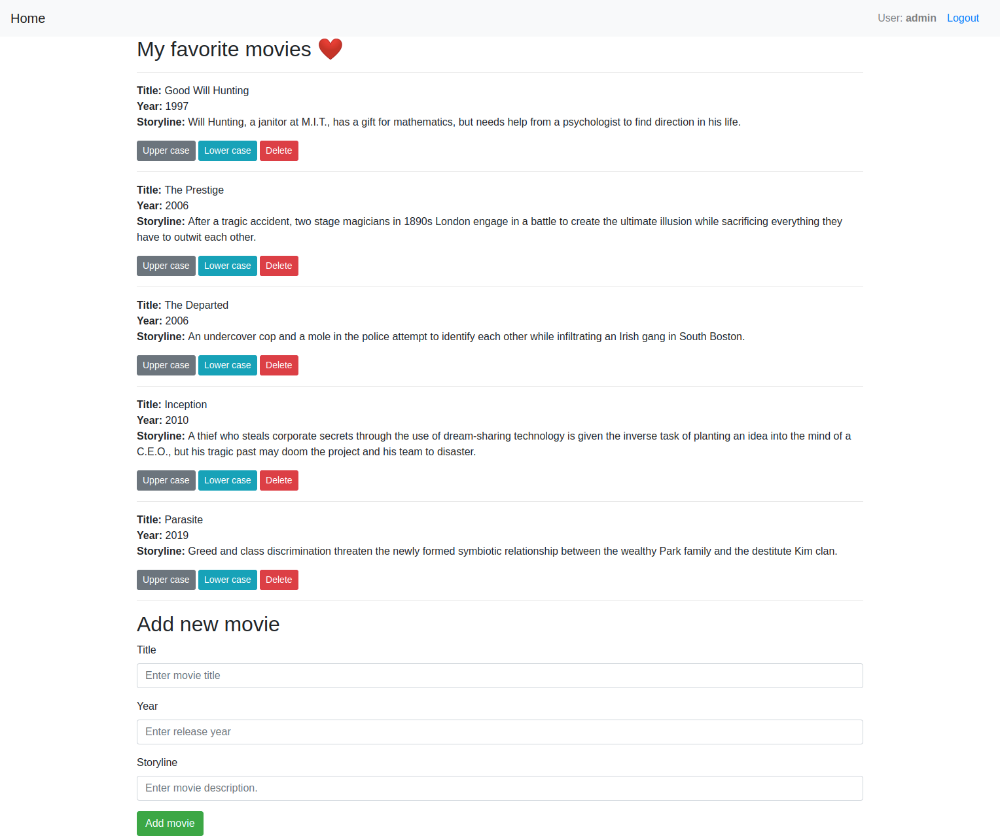

# DRF movies APIs with React frontend.

This is a dump app to list my favorite movies for demo projects purpose.



<br/>

### Technology stack:
- Django Rest Framework (DRF) - for backend
- React - for frontend.

<br/>

### Usage
- Prerequisites for local environment:
    - python3.8 as a prerequisite for Django 4.
    - node v13.12.0

- Setup:
    1. Local environment:
        - Clone the project.
        - On backend dir, run:
            - ```python3.8 -m venv venv```
            - ```source ./venv/bin/activate```
            - ```pip install -r requirements.txt```.
            - ```cp env.template .env```
            - ```python manage.py makemigrations```
            - ```python manage.py migrate```
            - ```python manage.py runserver```
            - open ```http://127.0.0.1:8000/api/v1/movie/``` for default rest movie endpoints.
            - open ```http://127.0.0.1:8000/api/v1/docs/``` for swagger documentation page.
        - On frontend dir, run:
            - ```npm start```
            - open ```http://localhost:3000/``` for dashboard.

    
    2. docker-compose:
        - On root dir, run ```docker-compose up```  <br> 
            OR  <br>  if you need to build your own images, don't forget to activate the build block in docker-compose.yml file and run ```docker-compose up --build``` 
        - open ```http://0.0.0.0``` for react frontend dashboard.
        - open ```http://0.0.0.0/api/v1/movie/``` for default rest movie endpoints.
        - open ```http://0.0.0.0/api/v1/docs/``` for swagger documentation page.

- Login:
    - Use below credentials:
>       username: admin
>       password: admin
Or create your own users.

<br/>

#### TODO
- Unit tests.

#### This branch is dedicated for AWS CodeBuild CI